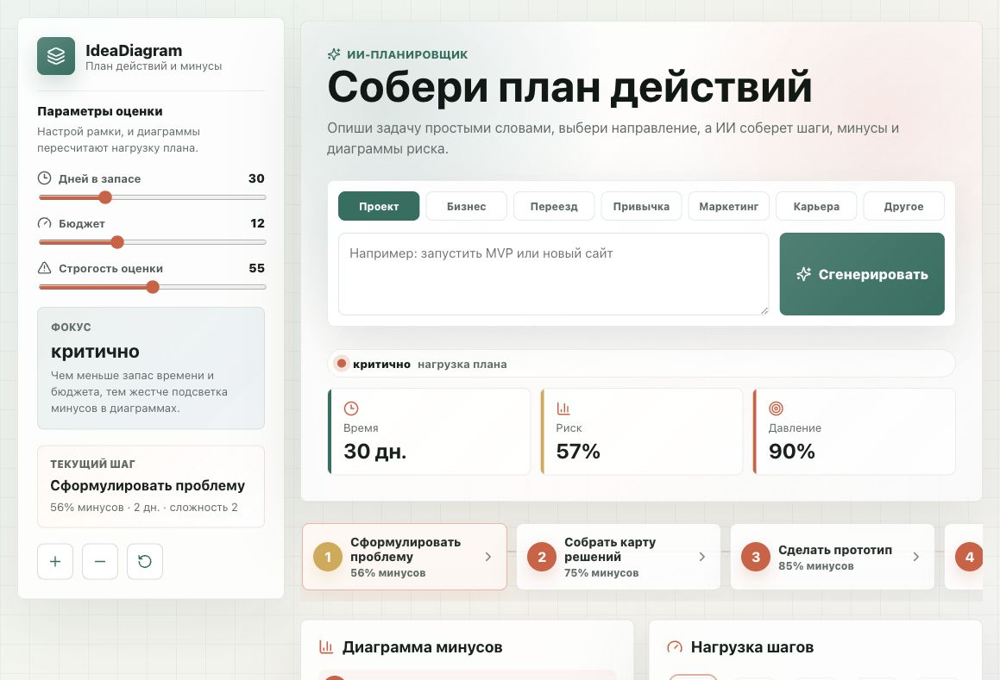

# IdeaDiagram

IdeaDiagram — React-приложение для сборки плана действий с оценкой минусов, нагрузки, времени, бюджета и сложности. Пользователь описывает задачу простыми словами, а ИИ собирает последовательность шагов и диаграммы риска.



## Возможности

- генерация плана действий через ИИ;
- оценка каждого шага по минусам, времени, деньгам и сложности;
- диаграмма минусов по шагам;
- диаграмма нагрузки шагов;
- ручное редактирование шагов;
- поиск минусов для выбранного шага через ИИ;
- адаптивный интерфейс для десктопа, планшета и телефона.

## Стек

- React 19
- Vite
- Node.js
- Polza AI API через OpenAI-compatible SDK
- Zod для проверки структуры ответа ИИ
- Lucide React для иконок

## Запуск локально

Установи зависимости:

```bash
npm install
```

Создай файл `.env` в корне проекта:

```env
POLZA_API_KEY=твой_ключ_polza
POLZA_MODEL=openai/gpt-4o
POLZA_BASE_URL=https://polza.ai/api/v1
PORT=8787
```

Запусти проект:

```bash
npm run dev
```

После запуска сайт будет доступен по адресу:

```txt
http://127.0.0.1:5173/
```

API запускается рядом на:

```txt
http://127.0.0.1:8787/
```

## Скрипты

```bash
npm run dev
```

Запускает Vite и локальный API одновременно.

```bash
npm run build
```

Собирает фронтенд в папку `dist`.

```bash
npm run preview
```

Запускает preview собранного фронтенда.

## API

Локальный сервер находится в `server.mjs`.

Доступные эндпоинты:

```txt
GET /api/health
POST /api/generate-plan
POST /api/analyze-step
```

`/api/generate-plan` генерирует полный план по цели пользователя.

`/api/analyze-step` обновляет только список минусов выбранного шага, не меняя риск, время, деньги и сложность.

## Переменные окружения

| Переменная | Описание |
| --- | --- |
| `POLZA_API_KEY` | ключ API Polza |
| `POLZA_MODEL` | модель, например `openai/gpt-4o` |
| `POLZA_BASE_URL` | базовый URL Polza API |
| `PORT` | порт локального API, по умолчанию `8787` |

Важно: `.env` не нужно коммитить в GitHub.

## Деплой

Текущая схема деплоя:

1. Проект клонируется на сервер.
2. В корне проекта создаётся `.env` с ключом Polza.
3. Проект запускается командой:

```bash
npm run dev
```

4. PM2 держит процесс запущенным.
5. Nginx проксирует домен на Vite:

```txt
http://127.0.0.1:5173
```

6. HTTPS подключается через Let’s Encrypt / Certbot.

## Домен

Рабочий домен:

```txt
https://ideadiagram.ru
```

## Безопасность

- Не хранить реальные API-ключи в коде.
- Не коммитить `.env`.
- После публикации ключей в чате или логах лучше перевыпустить ключ.
